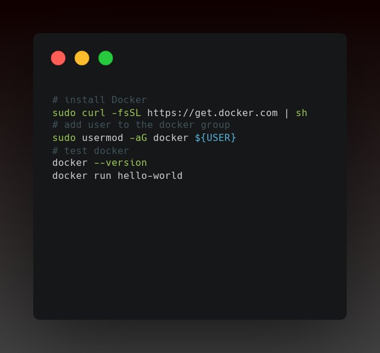

# Workshop

## Building Containerlab with cEOS-lab

<!-- Do not add page number on this slide -->
<!--
_paginate: false
-->

```text
How to build a lab environment
with Containerlab and cEOS-lab

Petr Ankudinov, 2023
```


---

# Credits and References

<style scoped>section {font-size: 22px;}</style>

> Credits to [Roman Dodin](https://netdevops.me/) and [other cLab contributors](https://github.com/srl-labs/containerlab/graphs/contributors) for making the world a better place!

This repository is based on many awesome open source repositories and some free/commercial Github features:

- [Containerlab](https://containerlab.srlinux.dev/)
- [VS Code](https://code.visualstudio.com/)
- [DevContainers](https://code.visualstudio.com/docs/remote/containers)
- [Marp](https://marp.app/)
- [Excalidraw VS Code Plugin](https://github.com/excalidraw/excalidraw-vscode)
- [Github Actions](https://github.com/features/actions)
- [Github Pages](https://pages.github.com/)
- [Github Codespaces](https://github.com/features/codespaces)
- [Carbon](https://carbon.now.sh/)
- And many more...

All photos are taken from [Pexels](https://www.pexels.com/) and [Unsplash](https://unsplash.com/). Excellent free stock photos resources. It's not possible to reference every author individually, but their work is highly appreciated.

---

# Agenda

<style scoped>section {font-size: 20px;}</style>


- Setup Docker on the host
- Install Containerlab and import cEOS-lab image
- Clone this repository and deploy the lab
- Inspect and destroy the lab
- Deploy the lab with a custom startup config
- Make a packet capture
- cLab in a Container
- Possible caveats

> This workshop is a step-by-step guide explaining how to build a lab environment with [Containerlab](https://containerlab.srlinux.dev/) and Arista cEOS-lab. It is  focusing on essential and cEOS-lab specific features. Please check [Containerlab documentation](https://containerlab.srlinux.dev/) for details.

---

# Prerequisites

- This workshop requires:
  - Ubuntu LTS 22.04 or later
  - 8 GB RAM and 4 vCPUs
- Only x86 architecture is supported. It is technically possible to [run Container lab on ARM](https://containerlab.dev/install/#containerlab-on-arm-based-macs), but there are no network images available for ARM as of Aug 2023.
- You can use [Github Codespaces](https://github.com/features/codespaces) or [VSCode devcontainer](https://code.visualstudio.com/docs/devcontainers/containers) for this workshop. The detailed procedure is described in the appendix.
- The appendix also provides instructions for creating a KVM VM with Ubuntu Cloud Image.
- There is also Vagrant file available in this repository. Use it at your own risk.

---

# Setup Docker on the Host

<style scoped>section {font-size: 22px;}</style>

> Check if Docker is already installed. In this case you can skip the steps below.

1. Install Docker on the host. The detailed instructions are available [here](https://docs.docker.com/engine/install/ubuntu/). You can used one-liner script for that.
2. Add your user to the `docker` group.
3. Logout and login again to apply the changes.
4. Check the Docker version and run `hello-world` container to test functionality.



<!--
# install Docker
sudo curl -fsSL https://get.docker.com | sh
# add user to the docker group
sudo usermod -aG docker ${USER}
# test docker
docker --version
docker run hello-world
-->

---

# Alt

<style scoped>section {font-size: 22px;}</style>

<div class="columns">
<div>

> Check if Docker is already installed. In this case you can skip the steps below.

1. Install Docker on the host. The detailed instructions are available [here](https://docs.docker.com/engine/install/ubuntu/). You can used one-liner script for that.
2. Add your user to the `docker` group.
3. Logout and login again to apply the changes.
4. Check the Docker version and run `hello-world` container to test functionality.

</div>
<div>

```bash
# install Docker
sudo curl -fsSL https://get.docker.com | sh
# add user to the docker group
sudo usermod -aG docker ${USER}
# test docker
docker --version
docker run hello-world
```

</div>
</div>
